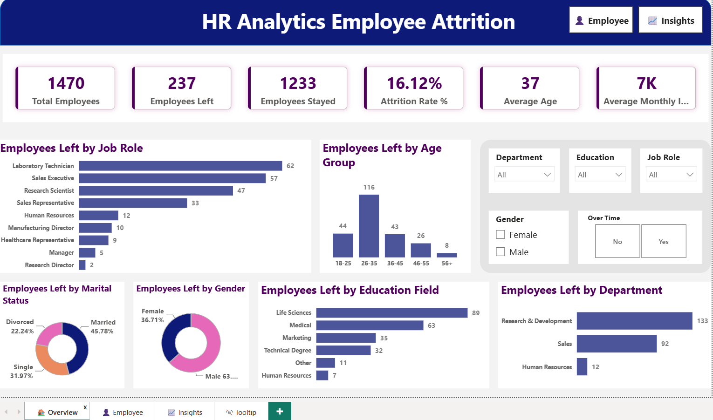
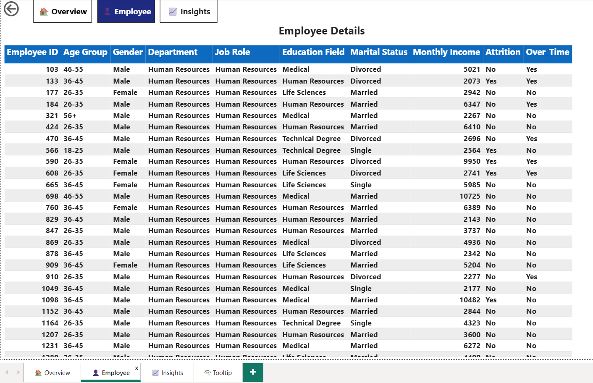
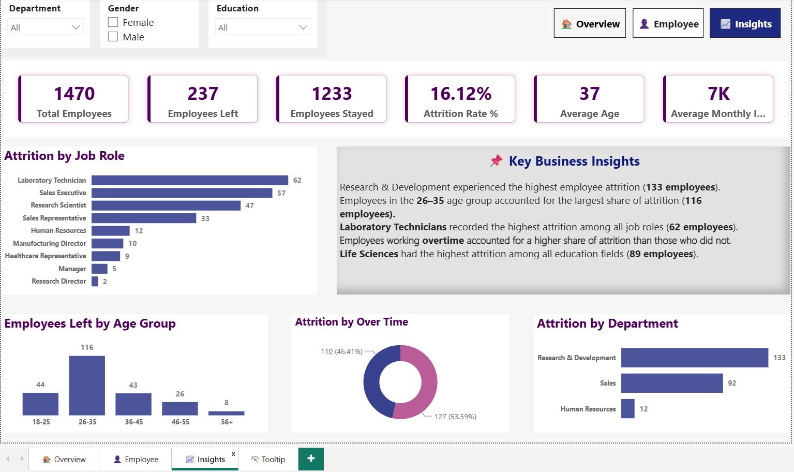

# HR Employee Attrition Analytics

## 📌 Project Overview
This project analyzes HR employee attrition data to identify workforce trends, understand the factors influencing employee turnover, and provide actionable business insights using SQL, Python, and Power BI.

## 🛠 Tools Used
- SQL (MySQL)
- Python (Pandas, NumPy, Matplotlib, Seaborn)
- Power BI
- Microsoft Excel

## 📊 Dataset
- Source: Kaggle
- Records: 1,470 Employees

## 📈 Project Workflow
1. Data Cleaning
2. Exploratory Data Analysis (EDA)
3. SQL Analysis
4. Dashboard Development
5. Business Insights

## 📌 Key Insights
- Calculated overall employee attrition rate.
- Analyzed attrition by department and job role.
- Identified salary trends and overtime impact.
- Compared employee income across departments.
- Ranked employees by salary using SQL window functions.
- Built an interactive Power BI dashboard for HR decision-making.

## 📂 Repository Contents
- SQL_Queries.sql
- HR_Employee_Attrition.pbix
- Dashboard Screenshot
- Dataset

## Dashboard Preview

### Overview

### Employee Details

### Insights

## 👩‍💻 Author
Anusha Sapavath
